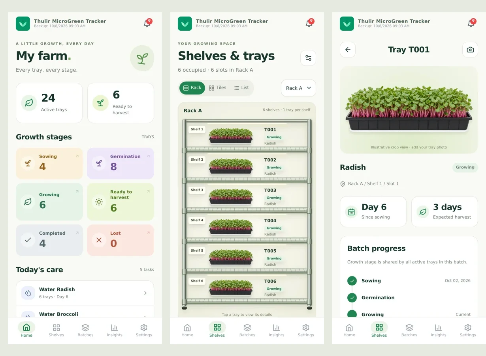

# Visual mobile UI

A working React/TypeScript UI integrated into the existing Capacitor app. Screenshots below use test fixtures, not customer data.



## Included

- Home: six colour-coded **tray** stage counts, real care tasks, batch creation.
- Shelves: realistic vertical metal rack, six shelves with one tray each by default, rack selector, shelf focus, optional tiles/list views, individual tray details and empty positions. Existing saved custom dimensions are preserved; Settings has a “Use vertical rack · 6 shelves × 1 tray” preset.
- Batches: existing edit, photo, note, watering, loss and harvest actions, with search, stage filters and tray links.
- Insights: existing analytics plus working crop/date-filtered PDF and CSV downloads through the existing native share/download helper.
- Settings: configurable rack/shelf/tray capacity and existing crop recipes, categories, loss reasons, backup/restore and app information.
- Bundled transparent microgreen artwork works offline; tray-specific photos replace illustrative artwork when available.

## Data compatibility

Storage schema 3 adds optional `config.farmLayout`. Existing numerical tray slots, records, photos and storage paths are unchanged. Legacy layouts default to vertical racks with six shelves and one tray per shelf, with a partial last rack. Invalid/mismatched layouts safely fall back. Capacity cannot be reduced below an occupied slot. Changing shelf dimensions asks for confirmation because the displayed physical location of slot numbers changes.

**Growth stage, watering and notes remain batch-level**, matching the existing application. The tray screen states this. Losses, harvested weights and photos remain tray-specific. This UI does not silently introduce independent tray growth stages. Rack dimensions are uniform; custom names or different dimensions per rack are not implemented.

Reports filter by **sowing date**, not harvest date. CSV quotes fields and neutralizes formula prefixes. PDF exports include pagination. Crop artwork is illustrative, not a live camera feed.

## Run and verify

```sh
npm ci
npm run dev
npm run lint
npx tsc --noEmit -p tsconfig.app.json
npm run build
node tests/e2e/farm-layout.cjs
# With the app running at 127.0.0.1:4173:
npx playwright install chromium
node tests/e2e/visual-ui.cjs
```

The new browser checks cover five-tab navigation, rack selection, shelf expansion, tray/batch navigation, PDF/CSV downloads, capacity protection, persistence and 320/390/768 px layouts. The layout checks cover slot boundaries, malformed settings and legacy data migration. Existing older end-to-end scripts use the previous Home/Config/Reports navigation and need selector updates before running against the new five-tab shell.

To package the native app, run `npm run cap:sync` on your development machine. Native device camera, sharing and Android/iOS builds were not verified in this environment.

## Individual screens

- [Home](01-home.webp)
- [Shelf tiles](02-shelves.webp)
- [Expanded shelf](03-expanded-shelf.webp)
- [Tray detail](04-tray.webp)
- [Batches](05-batches.webp)
- [Insights](06-insights.webp)
- [Settings](07-settings.webp)
